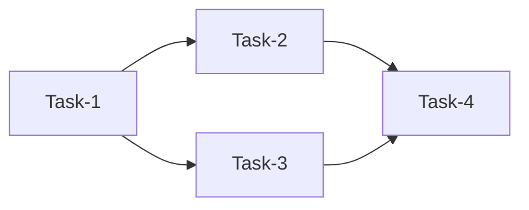
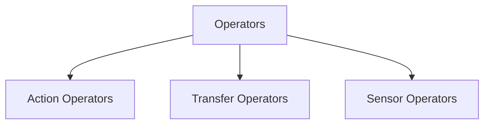

### What is Apache Airflow

It’s a platform for automating and monitoring workflows for scheduled jobs.It allows us to configure and schedule our processes according to our needs while simplifying and streamlining the process.

### Core components of Airflow

- **Web Server**: The web server is in charge of providing the user interface. It also allows to track job status and read logs from remote file storage.
- **Scheduler**: The scheduler handles scheduling the jobs, it decides which tasks to execute and when and where to execute them. It also decides the execution priority.
- **Metastore**: Metastore is a database where all the metadata related to Airflow and our data is present. It powers how other components would interact with each other. Stores information regarding the state of each task.
- **Executor**: The executor is a process that is tightly connected to the scheduler and determines the worker process which is actually going to execute the task.
- **Worker** : Worker is the process where the tasks are executed.

### DAG (Directed acyclic graph)

- DAG is a collection of small tasks which join together to perform a bigger task.
- It describes how to run a workflow. It is a collection of all the tasks we want to run organized in a manner that defines their relationship and dependencies.

### Task

- A Task is a basic unit of execution. 
- Each task may have an upstream or a downstream dependency defined. 

### Operators

Operator is a template for a predefined task that we can declare inside a DAG.
There are three types of operators :
1. Action Operators
2. Transfer Operators
3. Sensor Operators

