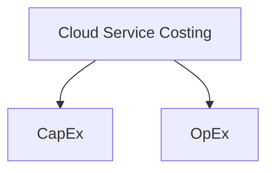

### Costing in Cloud

#### Capital Expenses (CapEx)
- Making upfront investment of what we are going to use.
- We consider in traditional IT
  - Building Data Centre
  - Purchase Servers
- This is not optimal and not flexible.

#### Operation Expense (OpEx)
- This means - paying actually for what we are using.
  - Electricity
  - Salaries
  - Maintenance
- This is extremely optimal and flexible. (This what we get in cloud because we pay what we use for.)