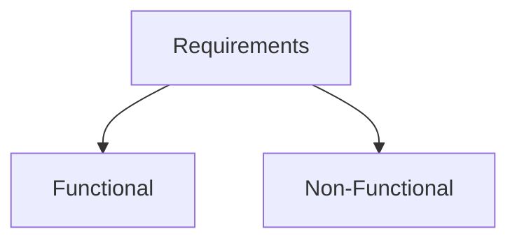
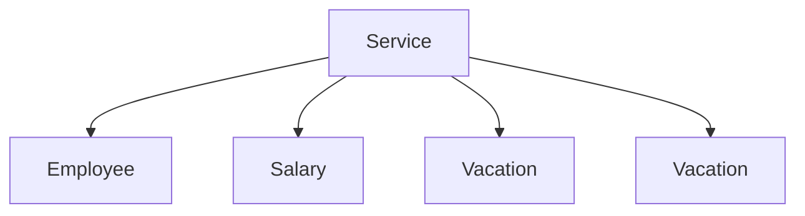
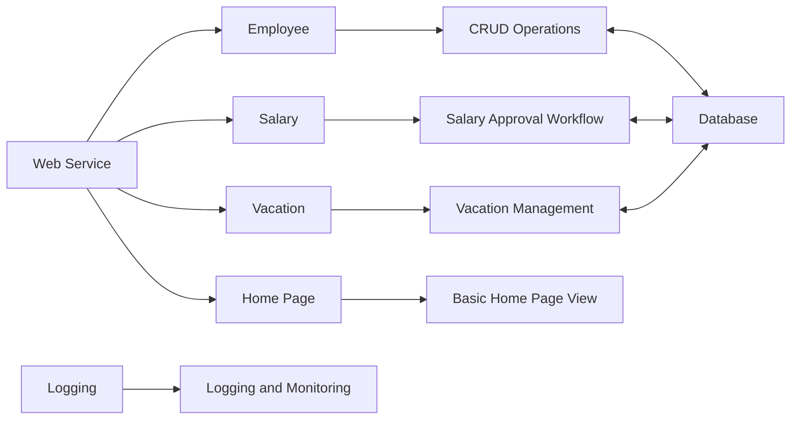

# Dunderly Company

## Step -1 Requirements for Dunderly Company

### Functional Requirements (What the system should do)

- Application must be Web Based. (Nothing needs to be installed in user desktop)
- Perform CRUD operations on employees.
- Manage Salaries
  - Allow managers to ask for salary changes.
  - Allow HR manager approve/reject request.
- Manage vacation days.
- Use external payment system.

### Non Functional Requirements

- Class information system
- Not a lot of users.
- Not a lot of data.
- Interface to external system.

### Non Functional Values

- 10 Concurrent Users.
- Manage 500 users.
- Data volume forcast : 25.5 GB
  - Relational and Unstructured.
- Not mission-critical
- File-Based structure.

## Step-2 Mapping Components

Based on the requirements given by the business, we need to create several service for each operational processing.

- There will be 4 services created:
1. Employee
2. Salary
3. Vacation
4. Home Page

All of these services will interact with each other using REST API via HTTP Requests and Responses.

## Step-3 Service Selection/ Technology Selection

### Coding Language and Why

- The right development language we can use are following:
  1. .NET
  2. Python

### List Down API Listings for all services

#### Employee Service API and EndPoints

| Function                            | API EndPoint                    | Request Type | Response Code                               |
|-------------------------------------|---------------------------------|--------------|---------------------------------------------|
| Get Employee ID                     | /api/v1/employee/{id}           | GET          | 200 OK, 400 Not Found                       |
| Add Employee                        | /api/v1/employee                | POST         | 201 Created, 400 Bad Request                |
| List all Employees by another param | /api/v1/employee/{name}=&{age}= | GET          | 200 OK, 400 Not Found                       |
| Update Employee                     | /api/v1/employee/{id}           | PUT          | 201 Updated, 400 Bad Request, 404 Not Found |
| Remove                              | /api/v1/employee/{id}           | DELETE       | 200 OK, 400 Not Found                       |

#### Salary Service API and EndPoints

| Function               | API EndPoint                          | Request Type | Response Code                               |
|------------------------|---------------------------------------|--------------|---------------------------------------------|
| Add Salary Request     | /api/v1/salaryRequest/                | POST         | 200 OK, 400 Not Found                       |
| Update Employee Salary | /api/v1/salaryRequest/{id}=&{salary}= | PUT          | 201 Updated, 400 Bad Request, 404 Not Found |
| Remove Salary Request  | /api/v1/salaryRequest/{id}            | DELETE       | 200 OK, 400 Not Found                       |
| Get Salary Request     | /api/v1/salaryRequest/{id}            | GET          | 200 OK, 400 Not Found                       |
| Approve Salary Request | /api/v1/salaryRequest/{id}/approve    | POST         | 201 Updated, 400 Bad Request, 404 Not Found |
| Denied Salary Request  | /api/v1/salaryRequest/{id}/denied     | POST         | 201 Updated, 400 Bad Request, 404 Not Found |

#### Vacation Service API and EndPoints

| Function                 | API EndPoint                         | Request Type | Response Code                               |
|--------------------------|--------------------------------------|--------------|---------------------------------------------|
| Add Vacation Request     | /api/v1/vacationRequest/             | POST         | 200 OK, 400 Not Found                       |
| Get Vacation Request     | /api/v1/vacationRequest/{id}         | GET          | 200 OK, 400 Not Found                       |
| Approve Vacation Request | /api/v1/vacationRequest/{id}/approve | POST         | 201 Updated, 400 Bad Request, 404 Not Found |
| Denied Vacation Request  | /api/v1/vacationRequest/{id}/denied  | POST         | 201 Updated, 400 Bad Request, 404 Not Found |

#### Official Documentation

- App Services : https://docs.microsoft.com/en-us/azure/app-service/overview
- App Services WebJobs : https://docs.microsoft.com/en-us/azure/app-service/webjobs-create
- Static Web Apps : https://docs.microsoft.com/en-us/azure/static-web-apps/overview
- Function Apps : https://docs.microsoft.com/en-us/azure/azure-functions/functions-overview
- Azure SQL : https://docs.microsoft.com/en-us/azure/azure-sql/azure-sql-iaas-vs-paas-what-is-overview
- Storage Account : https://docs.microsoft.com/en-us/azure/storage/blobs/storage-blobs-overview
- Application Gateway : https://docs.microsoft.com/en-us/azure/application-gateway/overview
- Application Gateway + WAF : https://docs.microsoft.com/en-us/azure/web-application-firewall/ag/ag-overview
- Log Analytics : https://docs.microsoft.com/en-us/azure/azure-monitor/logs/log-analytics-overview

