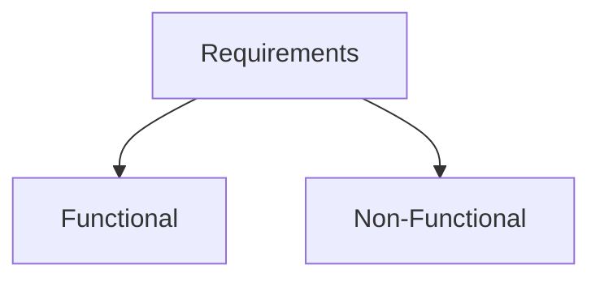
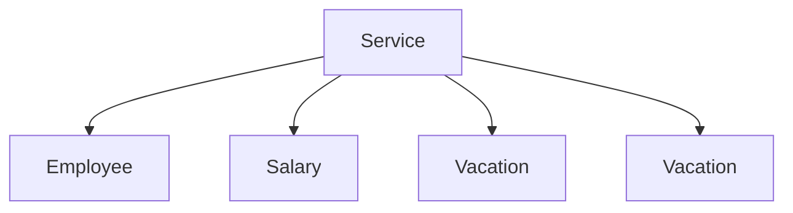
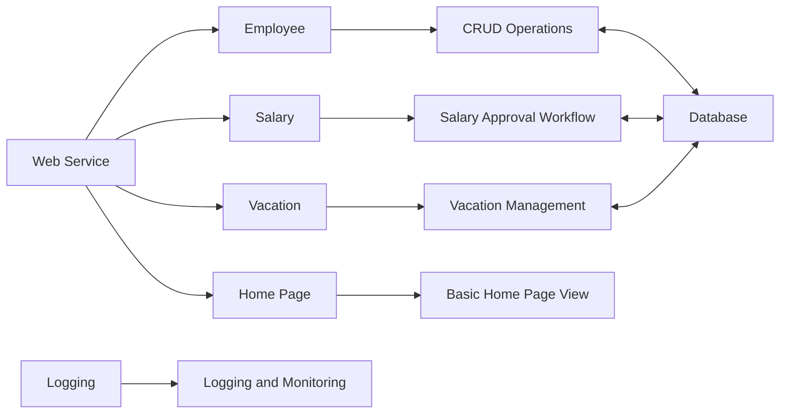
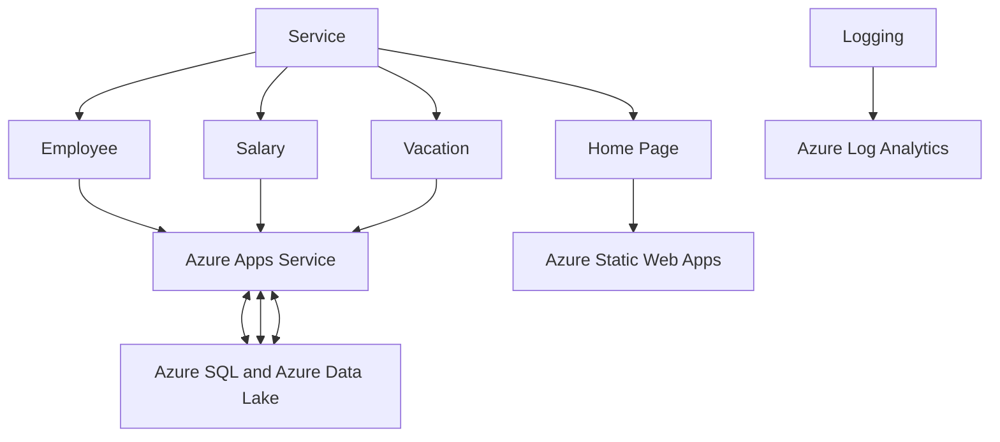

## Dunderly Company

### Step -1 Requirements for Dunderly Company

#### Functional Requirements (What the system should do)

- Application must be Web Based. (Nothing needs to be installed in user desktop)
- Perform CRUD operations on employees.
- Manage Salaries
  - Allow managers to ask for salary changes.
  - Allow HR manager approve/reject request.
- Manage vacation days.
- Use external payment system.

#### Non Functional Requirements

- Class information system
- Not a lot of users.
- Not a lot of data.
- Interface to external system.

#### Non Functional Values

- 10 Concurrent Users.
- Manage 500 users.
- Data volume forcast : 25.5 GB
  - Relational and Unstructured.
- Not mission-critical
- File-Based structure.

### Step-2 Mapping Components

Based on the requirements given by the business, we need to create several service for each operational processing.

- There will be 4 services created:
1. Employee
2. Salary
3. Vacation
4. Home Page

All of these services will interact with each other using REST API via HTTP Requests and Responses.

### Step-3 Service Selection/ Technology Selection

#### Coding Language and Why

#### List Down API Listings for all services
- GET
- PUT
- POST
- DELETE
- Return Code

#### Include Costing

