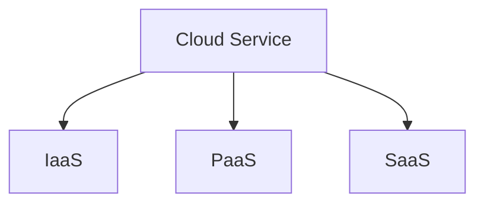

### Types of Cloud Services

#### Infrastructure as a Srvice (IaaS)
- In this case, the cloud provides the :
  - Compute
  - Network
  - Storage
- The best example is Virtual machines, where the cloud service provider provides the machine, disk and network.

#### Platform as a Service (PaaS)
- In this case, the cloud provides:
  - Compute
  - Network
  - Disk/Storage
  - Security
  - Maintenance
  - Patching
- The client just need to deploy the code and run the process.
- The best examples are : Web Apps.

#### Software as a Service (SaaS)
- In this cloud provides everything which act as everything (including application, network, patching, disk and to name a few)
- Best examples are : Outlook, Salesforce. 