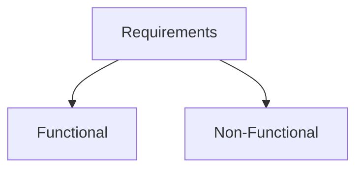
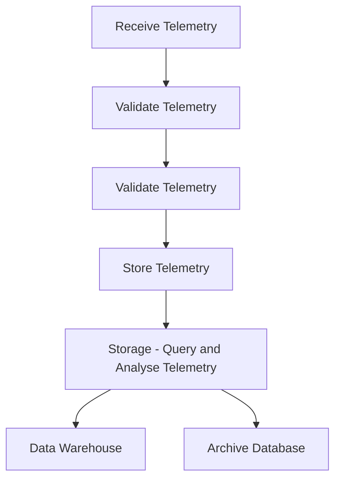

# Muscar Auto Company

## Step -1 Requirements for Muscar Auto Company

### Functional Requirements (What the system should do)

- Web Based Application.
- Receive telemetry data from cars (location, speed, breakdowns etc)
- Store telemetry data in persistent storage (storage that lasts long for BI)
- Display dashboard of summary data
- Perform analysis on the data

### Non Functional Requirements

- The system is data intensive system and data processing.
- Not lot if users.
- Questions we can ask based on the requirements
  1. How many expected concurrent users ? - 10
  2. How many telemetry data we received in a second ? - 7000 messages
  3. What is the size of message ? - 1 KB
  4. Is the message same for all outputs and is it schemaless ? - Yes
  5. What is the SLA ? - Highest possible SLA

### Calculate Data Volume 🤨
- 1 Message = 1KB
- 7000 Messages per second = 7 MB per second
  - 25 GB per hour
  - 605 GB per day
  - 221 TB per year 🥶 That's HUGE 🥶

NOTE : WHENEVER DATA IS HUGE - WE SHOULD ALWAYS ASK FOR **_RETENTION PERIOD_** OF THE DATA

**Retention Period** : Defines how long the records are kept in database.

What happens after the retention period
- We should delete the data.
- Move the data to archived location.

| **Data Type** | **Used For**                                                        | **Retention Period** |
|---------------|---------------------------------------------------------------------|----------------------|
| Operational   | Monitor realtime data from the cars.   Performance is critical. | 7 Days               |
| Aggregated    | Reports, BI , Not a real time, can be slower                        | Forever              |

## Step -2 Mapping the Components

Based on the requirements given by the business, we need to create several service for each operational processing.

### Receive Telemetry
This layer is only responsible for getting the telemetry data and nother other tasks needs to be done on this layer since it is a heavy loading job.

### Telemetry Pipeline
This layer only sends the telemetry data for processing.

### Validate Telemetry
This layer will listen to the queue and does the actual processing. It essentially validates the messages and store them in storing layer.

### Operational Database
This layer stores the telemetry data coming from the validation layer. This stores both the real time data and actual data. This will essentially populate the data ware house layer for aggregation processing.

### DatawareHouse
This layer basically holds the aggregation data that is specifically curated for the BI dashboard. 

NOTE : Since we are using the telemetry data and we are using the IOT devices - we have to capture the telemetry data using the TCP protocal only since most the IOT devices only used the TCP (Transmission Control Protocol) for communication.

## Step-3 Service Selection/ Technology Selection

### Receive Telemetry

- This is going to be service or basically a console which essentially takes the TCP requests from the IOT devices

- Language - Node Js (great performance for gateway)
- For TCP requests - we can use Azure VM + VM Scale Set + Load Balancers.

### Telemetry Pipeline

- For this we can use the event hub service due to following reasons:
  1. The size of message is 1 MB (maximum size)
  2. It can process heavy load of the data (used for big data processing)

### Telemetry Processing
- This can be done by Azure Step Functions for the processing.

### Operational Database and Storage

- For this operational database we can use the cosmos db since the schema of the messages are not defined and requires the schema less storage, so we can store the data based on key and value in cosmos db

- For the storage of the data, since this will be archived after certain amount of time, we have to use Azure data lake storage with storage type as archive.

## Official Documentation

Load Balancer

https://docs.microsoft.com/en-us/azure/load-balancer/load-balancer-overview

VM Scale Set

https://docs.microsoft.com/en-us/azure/virtual-machine-scale-sets/overview

Event Hubs

https://docs.microsoft.com/en-us/azure/event-hubs/event-hubs-about

App Services

https://docs.microsoft.com/en-us/azure/app-service/overview

Function Apps

https://docs.microsoft.com/en-us/azure/azure-functions/functions-overview

Cosmos DB

https://docs.microsoft.com/en-us/azure/cosmos-db/introduction

Storage Account

https://docs.microsoft.com/en-us/azure/storage/blobs/storage-blobs-overview
