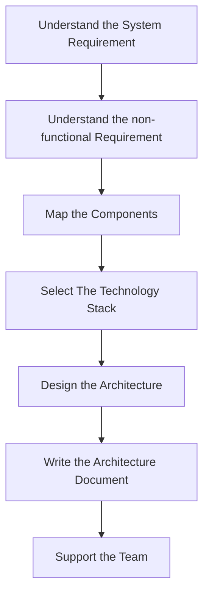

## The Architectural Process

### What are the Steps 

#### Understand the System Requirement 

- This step includes the understanding of the business and system.
- Requirements = What system should do + what business wants.

#### Understand the non-functional Requirement

- Define the technical and service level agreements.
- For example:
  - Decide the number of users.
  - Decide the type of volume to be used.
  - Decide the performance or calculate the performance.
  - Decide the load on the service/app.
- These are more important than normal requirements since this can affect the actual usage of the system.

#### Map the Components (components are the steps and tasks)

- This step essentially describe the system's functionality
  - which means what is we going to produce.
- This requires communication with client or the business on what to perform.

#### Select The Technology Stack

- As the name mention, we have to decide the technology for the system.
- This includes
  - Backend
  - Frontend
  - Data Source
- The selection should be careful and rational.

#### Design the Architecture

- In this step we design the overall system and put down all the core components to design a system (like sharding, fault tolerance, CAP, load balancing etc.)
- This has a room of changes that is why documentation is required.

#### Document the Architecture

- In this step we document the whole process of architecture. We have to put as much as details as possible.
- We need to make sure that the document can be well understood by all the level of management including developers.

