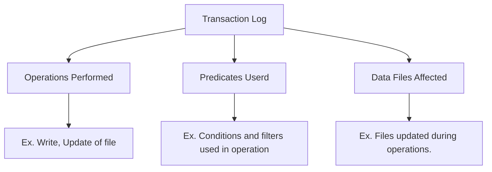

# Delta Lake

#### What is delta lake
1. It's an open-source storage framework.
2. It brings reliability to data lakes.
3. Since data lakes has come issues like data inconsistency and performance issues, delta lake helps to overcome those issues.

#### What delta lake is/is not 
| What it is                         | What its not                        |
|------------------------------------|-------------------------------------|
| Storage framework or Storage Layer | Storage Format or Storage Medium    |
| Lakehouse                          | Data warehouse or Database Service. |

Delta table are stored on delta lake as one or more parquet file formats. Along with this file, the delta lake stores a **Transaction Log** file.

#### Transaction Logs

- It basically **keeps the record of every transaction** done on the table.
- It is the **Single Source of Truth**.
- Its a json file which consist of :
 

#### Writer/Reads

**Writer Process** --> Writer process first writes the data and then create a transaction log json (consist of writing and file creating part) 

**Reader Process** --> Reader process first read the transaction log and then start reading the files created or updated under transaction log (after writing or updating process).

**Update Process** --> In update process, if there is an update in the file_1 then it creates a copy of file_1 (named file_3) and did all the updates in that and then write the transaction log.

#### Delta Lake Advantages

1. Brings **ACID Transaction** to object storage.
2. Handle **scalable metadata**.
3. Full **audit trial** of all changes.
4. Builds upon a standard data formats : **Parquet + JSON**.

