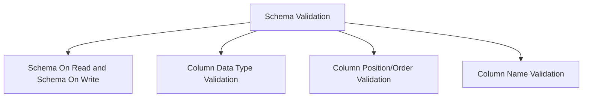

# Schema Validation in Data Engineering

Schema validation ensures that data adheres to predefined structures and constraints before being processed or stored. It prevents data quality issues, enforces consistency, and supports reliable analytics.



---

## **1. Schema-on-Read vs Schema-on-Write**

### **Schema-on-Write**
- **Definition:** Schema is enforced **when data is written** into the system.
- **Use Case:** Traditional Data Warehouses (e.g., SQL databases, Hive tables).
- **Advantages:**
  - Ensures data quality upfront.
  - Prevents bad data from entering storage.
- **Disadvantages:**
  - Slower ingestion since validation happens at write time.
  - Less flexible for semi-structured or unstructured data.

### **Schema-on-Read**
- **Definition:** Schema is applied **when data is read** from storage.
- **Use Case:** Data Lakes (e.g., Databricks Delta Lake, Amazon S3 with Athena).
- **Advantages:**
  - Flexible – supports raw/semi-structured data.
  - Faster ingestion; schema is not checked at write time.
- **Disadvantages:**
  - Potential for inconsistent data quality.
  - Errors detected later, at read/processing time.

---

## **2. Column Order Validation**
- Ensures that columns in incoming data match the defined schema order.
- **Why important?**
  - Incorrect order may cause misaligned data.
- **Example Check (Python/PySpark):**
  ```python
  expected_columns = ["id", "name", "age"]
  actual_columns = df.columns
  if actual_columns != expected_columns:
      raise ValueError("Column order mismatch!")

## 3. Data Type Validation
Ensures each column has the correct data type as per schema.

### Why important?
- Prevents type errors in downstream transformations and analytics.

### Example Check (PySpark)
```python
from pyspark.sql.types import IntegerType, StringType
expected_schema = {"id": IntegerType(), "name": StringType(), "age": IntegerType()}

for field in df.schema.fields:
    if field.name in expected_schema and not isinstance(field.dataType, type(expected_schema[field.name])):
        raise ValueError(f"Data type mismatch for column: {field.name}")
```

## 4. Column Name Validation
Ensures column names match expected schema (case sensitivity may apply).

### Why important?
- Prevents incorrect mapping and downstream failures.

### Example Check
```python
expected_columns = {"id", "name", "age"}
if set(df.columns) != expected_columns:
    raise ValueError("Column names mismatch!")
