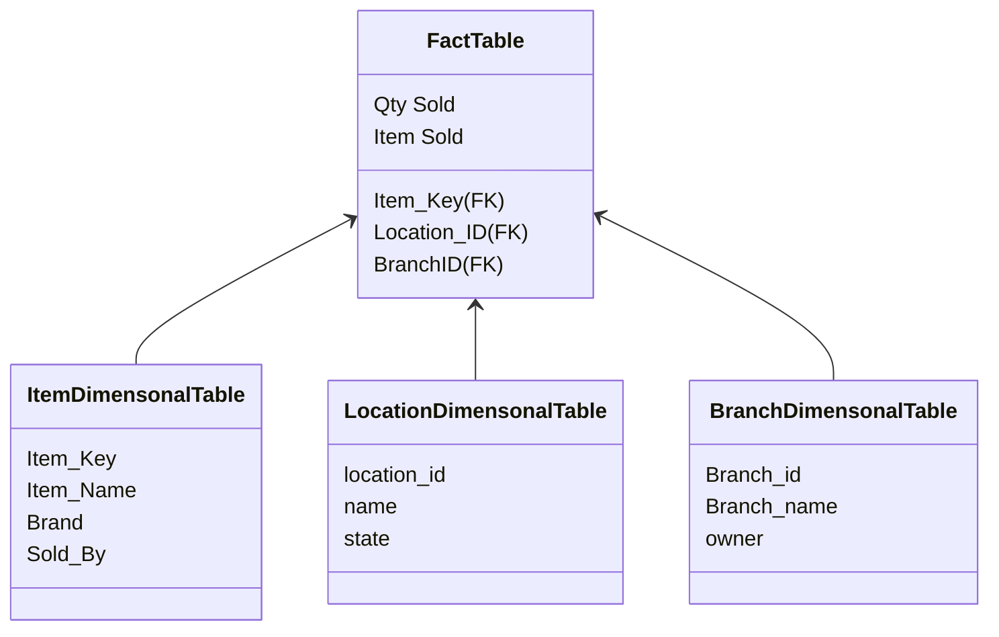

# Fact Table vs Dimensional Table

#### Fact Table

- A fact table is a primary table in a dimensional model.
- A fact table defines the atomic level and granularity of the data.
- A fact table contains:
  - Measurement and Facts
  - Foreign Key to dimensional table.

#### Dimensional Table

- The dimension table contains dimensions of fact table.
- They are joined to fact table via a foreign key.
- Dimension tables are de-normalized tables.
- The dimension can also contain one or more hierarchical relationships (means it also have sub-dimensional tables).

| Parameters | Fact Table |                                                        Dimension Table |
|:-----------|    :----:   |-----------------------------------------------------------------------:|
| Definition | Measurements, metrics or facts about a business process.       | Descriptive details of fact table and attributes present in dim tables |
| Characteristic  | Located at the center of a star or snowflake schema and surrounded by dimensions.        |                                                               Connected to the fact table and located at the edges of the star or snowflake schema |
| Key | Primary Key in fact table is mapped as foreign keys to Dimensions.       | Dimension table has a primary key columns that uniquely identifies each dimension. |

