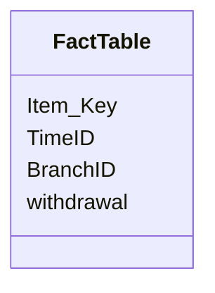

# Fact Table vs Dimensional Table

#### Fact Table

- A fact table is a primary table in a dimensional model.
- A fact table defines the atomic level and granularity of the data.
- A fact table contains:
  - Measurement and Facts
  - Foreign Key to dimensional table.

#### Dimensional Table

