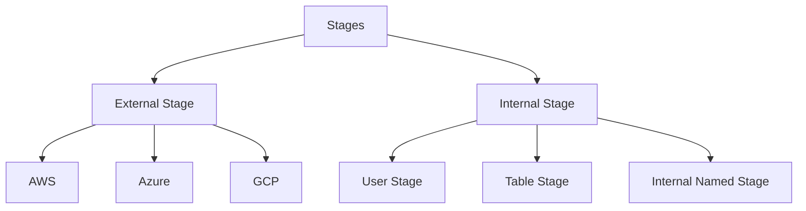

# Loading Data in Snowflake

#### Types of loading:
1. **Bulk Loading**
   1. Most Frequent Method 
   2. It uses warehouses.
   3. Loading from stages.
   4. Copy command
   5. Transformation are possible. 
2. **Continuous Loading**
   1. Design to load small volumes of data.
   2. Automatically once they are added to stages.
   3. Latest results. 
   4. Snowpipes (Serverless feature) 
   5. Tables are not normalized

#### Stages in Snowflake
- A stage is a location in snowflake where we can store our data.
- From this **location we can upload and download the data to/from snowflake**.

#### Internal Stages
- This a type of storage which is managed by snowflake. 
- Snowflake manage this location for any kind of operation.
- We can use the `snowsql` and use the `PUT` command.
- The data when use the `PUT`, will automatically :
  - gets compressed (.gzip)
  - get encrypted using AES-256 encryption
- The data can be downloaded using the `GET` command.

#### Types of Internal Stages
1. User Stage
2. Table Stage
3. Internal Named Stage

##### User Stage (Denoted as `@~`)
- This tied to a User.
- The files under this stage can not be accessed by any other user.
- Every user has a default stage.
- Once the data is staged in User Stage , it can't be altered or dropped.
- We can load data into multiple tables.

##### Table Stage (Denoted as `@%TABLE_NAME`)
- This tied to particular table.
- The data can not be used for any other table.

##### Internal Named Stage (Denoted as `@STAGE_NAME`)
- This is most usable and user-friendly stage.
- Its nothing but a snowflake database object.
- Everyone has a privilege to access this.

#### External Stages
- This is a type of storage which is managed by external cloud services.
- The external cloud providers storage service act as storage container for all kind of operations on snowflake.
- They are like Internal Named Stage since everyone can use it and its like normal database object.
- We need reference it to external stage.
- We can use the STORAGE_INTEGRATION for access related best practices.

Command for external stage (S3) : `create stage <stage_name> URL = 's3://bucket/pat'`

Command for external stage (Blob) : `create stage <stage_name> URL = 'azure://account/blob.core.windows.net/container/path/'`

#### Important Commands

- `List @STAGE_NAME` : List External/Internal Named Stage
- `List @~` : List User Stage
- `List @%TABLE_NAME` : List Table Stage

#### Copy FROM Stage/ Copy TO Stage
`COPY INTO TABLE_NAME
FROM @STAGE_NAME`

`COPY INTO @STAGE_NAME
FROM TABLE_NAME`

