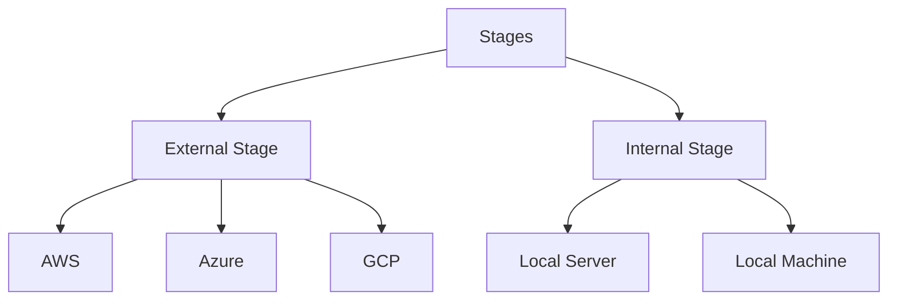

# Loading Data in Snowflake

#### Types of loading:
1. **Bulk Loading**
   1. Most Frequent Method 
   2. It uses warehouses.
   3. Loading from stages.
   4. Copy command
   5. Transformation are possible. 
2. **Continuous Loading**
   1. Design to load small volumes of data.
   2. Automatically once they are added to stages.
   3. Latest results. 
   4. Snowpipes (Serverless feature) 
   5. Tables are not normalized

#### Stages
Location of data files from where data can be loaded.

#### Create Stage Command

